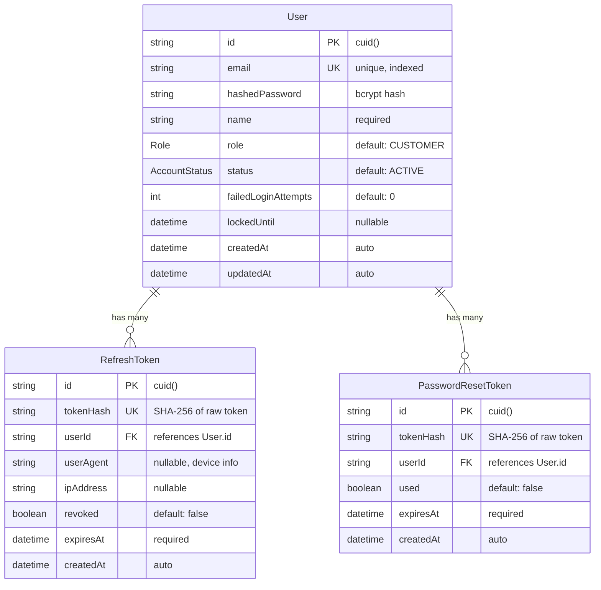
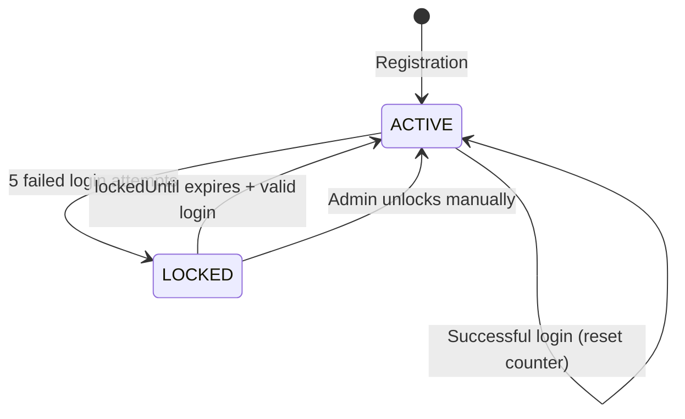
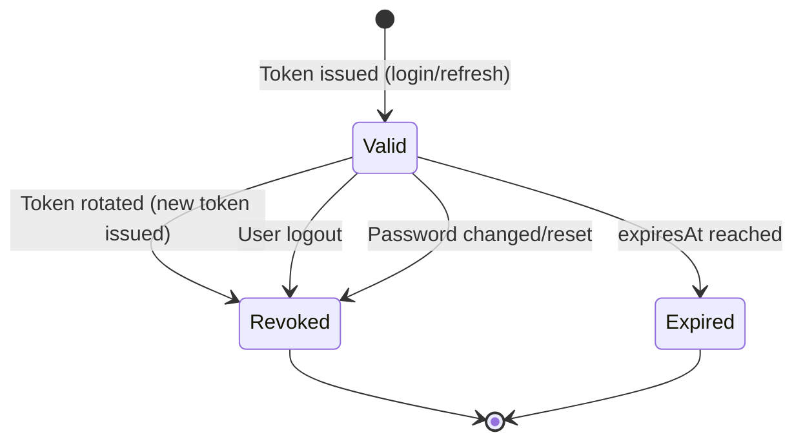
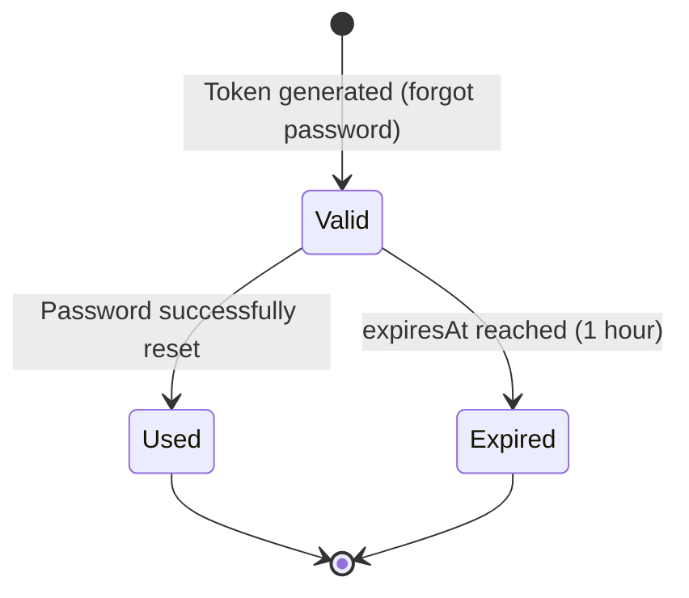

# Data Model: Identity & Access Management

**Feature**: 001-identity-access
**Date**: 2026-05-21
**ORM**: Prisma (PostgreSQL)

## Entity Relationship Diagram



## Enums

### Role

| Value | Description |
|-------|-------------|
| `CUSTOMER` | Default role. Can view products, manage own profile/orders. |
| `MANAGER` | Can manage products and view order reports. Cannot manage users. |
| `ADMIN` | Full access. Can manage users, assign roles, manage all resources. |

### AccountStatus

| Value | Description |
|-------|-------------|
| `ACTIVE` | Normal operating state. User can log in. |
| `LOCKED` | Temporarily locked due to failed login attempts. Automatically unlocks after `lockedUntil`. |

## Prisma Schema

```prisma
generator client {
  provider = "prisma-client-js"
}

datasource db {
  provider = "postgresql"
  url      = env("DATABASE_URL")
}

enum Role {
  CUSTOMER
  MANAGER
  ADMIN
}

enum AccountStatus {
  ACTIVE
  LOCKED
}

model User {
  id                  String   @id @default(cuid())
  email               String   @unique
  hashedPassword      String
  name                String
  role                Role     @default(CUSTOMER)
  status              AccountStatus @default(ACTIVE)
  failedLoginAttempts Int      @default(0)
  lockedUntil         DateTime?

  refreshTokens       RefreshToken[]
  passwordResetTokens PasswordResetToken[]

  createdAt           DateTime @default(now())
  updatedAt           DateTime @updatedAt

  @@index([email])
  @@map("users")
}

model RefreshToken {
  id        String   @id @default(cuid())
  tokenHash String   @unique
  userId    String
  user      User     @relation(fields: [userId], references: [id], onDelete: Cascade)
  userAgent String?
  ipAddress String?
  revoked   Boolean  @default(false)
  expiresAt DateTime

  createdAt DateTime @default(now())

  @@index([userId])
  @@index([tokenHash])
  @@map("refresh_tokens")
}

model PasswordResetToken {
  id        String   @id @default(cuid())
  tokenHash String   @unique
  userId    String
  user      User     @relation(fields: [userId], references: [id], onDelete: Cascade)
  used      Boolean  @default(false)
  expiresAt DateTime

  createdAt DateTime @default(now())

  @@index([userId])
  @@index([tokenHash])
  @@map("password_reset_tokens")
}
```

## Validation Rules

### User

| Field | Rule |
|-------|------|
| `email` | Must be a valid email format (RFC 5322). Must be unique across all users. |
| `hashedPassword` | Raw password: min 8 chars, at least 1 uppercase, 1 lowercase, 1 digit. Stored as bcrypt hash (cost 12). |
| `name` | Required. Min 1 character, max 100 characters. Trimmed of leading/trailing whitespace. |
| `role` | Must be one of: CUSTOMER, MANAGER, ADMIN. Default: CUSTOMER. |
| `failedLoginAttempts` | Integer >= 0. Reset to 0 on successful login. |
| `lockedUntil` | Nullable. Set to `now() + 15 minutes` when `failedLoginAttempts` reaches 5. Cleared on successful login. |

### RefreshToken

| Field | Rule |
|-------|------|
| `tokenHash` | SHA-256 hash of the raw 64-byte hex token. Must be unique. |
| `expiresAt` | Must be in the future at creation time. Default: 7 days from creation. |
| `revoked` | Set to `true` on logout, password change, or token rotation. |

### PasswordResetToken

| Field | Rule |
|-------|------|
| `tokenHash` | SHA-256 hash of the raw 64-byte hex token. Must be unique. |
| `expiresAt` | Must be in the future at creation time. Default: 1 hour from creation. |
| `used` | Set to `true` after successful password reset. Cannot be reused. |

## State Transitions

### User Account Status



### Refresh Token Lifecycle



### Password Reset Token Lifecycle


