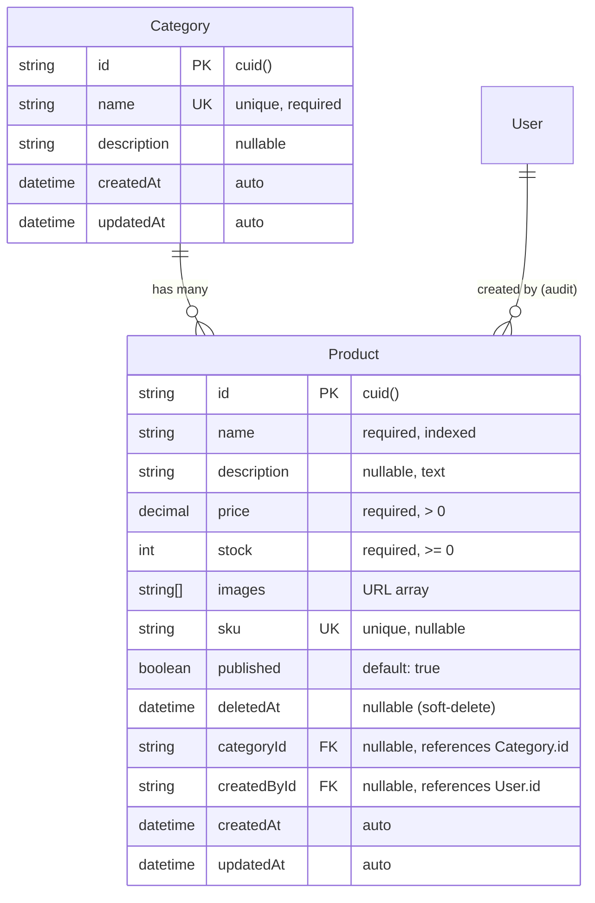
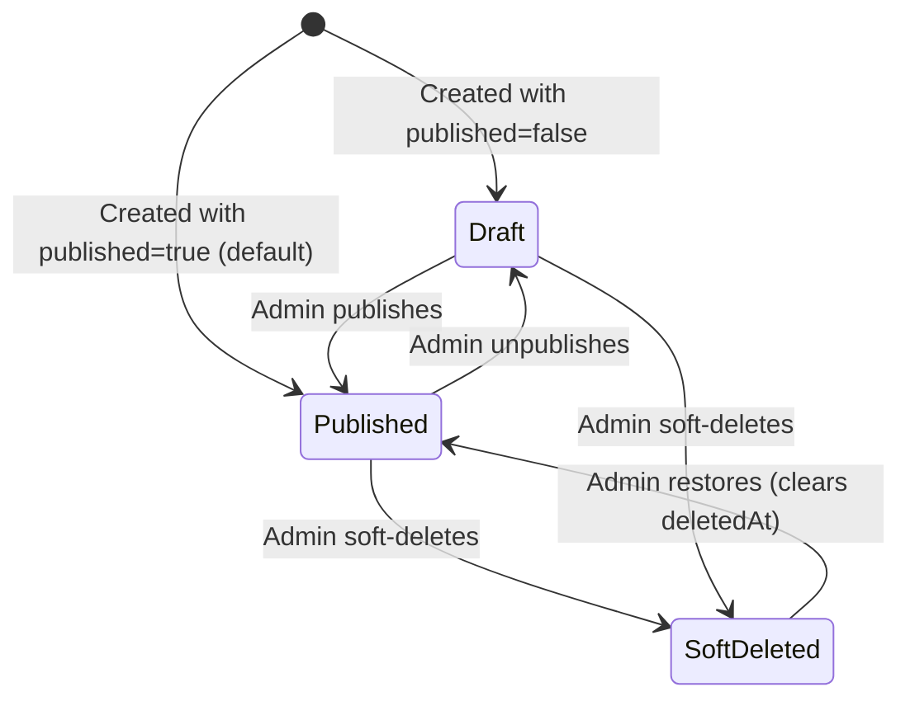

# Data Model: Product Catalog

**Feature**: 002-product-catalog
**Date**: 2026-05-21
**ORM**: Prisma (PostgreSQL)

## Entity Relationship Diagram



## Prisma Schema (additions to existing schema.prisma)

```prisma
model Category {
  id          String    @id @default(cuid())
  name        String    @unique
  description String?

  products    Product[]

  createdAt   DateTime  @default(now())
  updatedAt   DateTime  @updatedAt

  @@map("categories")
}

model Product {
  id          String    @id @default(cuid())
  name        String
  description String?   @db.Text
  price       Decimal   @db.Decimal(10, 2)
  stock       Int       @default(0)
  images      String[]
  sku         String?   @unique
  published   Boolean   @default(true)
  deletedAt   DateTime?

  categoryId  String?
  category    Category? @relation(fields: [categoryId], references: [id], onDelete: SetNull)

  createdById String?
  createdBy   User?     @relation(fields: [createdById], references: [id], onDelete: SetNull)

  createdAt   DateTime  @default(now())
  updatedAt   DateTime  @updatedAt

  @@index([name])
  @@index([categoryId])
  @@index([deletedAt])
  @@index([published, deletedAt])
  @@map("products")
}
```

> **Note**: The `User` model defined in feature 001 needs a reverse relation added:
> ```prisma
> // Add to existing User model in schema.prisma
> products Product[]
> ```

## Full-Text Search Migration

After the standard Prisma migration, apply a custom SQL migration to set up the `tsvector` search column:

```sql
-- Add search vector column
ALTER TABLE "products" ADD COLUMN "search_vector" tsvector;

-- Create GIN index for fast full-text search
CREATE INDEX idx_products_search ON "products" USING GIN("search_vector");

-- Create trigger function to auto-update search vector on INSERT/UPDATE
CREATE OR REPLACE FUNCTION products_search_trigger() RETURNS trigger AS $$
begin
  new."search_vector" :=
    setweight(to_tsvector('english', coalesce(new.name, '')), 'A') ||
    setweight(to_tsvector('english', coalesce(new.description, '')), 'B');
  return new;
end
$$ LANGUAGE plpgsql;

CREATE TRIGGER tsvectorupdate BEFORE INSERT OR UPDATE
ON "products" FOR EACH ROW EXECUTE PROCEDURE products_search_trigger();

-- Backfill existing products (if any)
UPDATE "products" SET "search_vector" =
  setweight(to_tsvector('english', coalesce(name, '')), 'A') ||
  setweight(to_tsvector('english', coalesce(description, '')), 'B');
```

## Validation Rules

### Product

| Field | Rule |
|-------|------|
| `name` | Required. Min 1 character, max 255 characters. Trimmed. |
| `description` | Optional. Max 5000 characters. |
| `price` | Required. Must be > 0. Decimal with 2 decimal places (max 99,999,999.99). |
| `stock` | Required. Integer >= 0. Default: 0. |
| `images` | Optional. Array of strings. Each string must be a valid URL. Max 10 images. |
| `sku` | Optional. Unique across all products. Max 50 characters. |
| `published` | Optional. Boolean. Default: true. |
| `categoryId` | Optional. Must reference an existing Category if provided. |

### Category

| Field | Rule |
|-------|------|
| `name` | Required. Min 1 character, max 100 characters. Must be unique. Trimmed. |
| `description` | Optional. Max 500 characters. |

## State Transitions

### Product Lifecycle



### Product Visibility Rules

| State | `published` | `deletedAt` | Visible to Customers | Visible to Admin |
|-------|-------------|-------------|---------------------|-----------------|
| Published | `true` | `null` | ✅ Yes | ✅ Yes |
| Draft | `false` | `null` | ❌ No | ✅ Yes |
| Soft-deleted | any | `<timestamp>` | ❌ No | ✅ Yes (with filter) |
